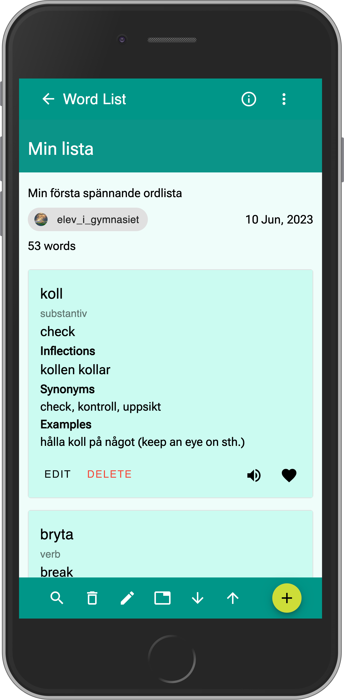
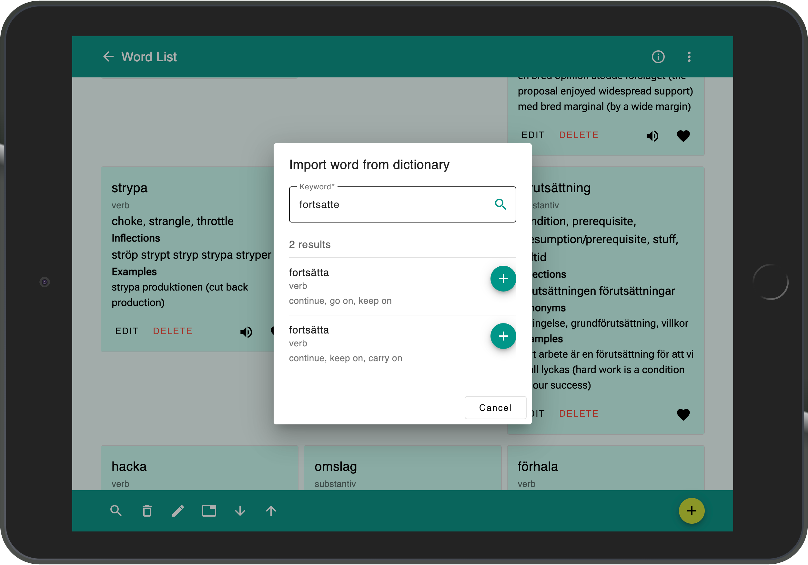

# Ordlista 🇸🇪
Ordlista is a Serverless Single Page Application that provides an easy way to build your Swedish vocabulary lists. The app also has integration with [Folkets lexikon](https://folkets-lexikon.csc.kth.se) where user can search and import words directly from the dictionary. It is built using the Angular framework for the frontend and leverages multiple AWS serverless services such as AWS Lambda, AWS API Gateway, AWS DynamoDB, etc. The app is deployed to [Netlify](https://ordlista.netlify.app) and AWS S3 that is accessed via [AWS CloudFront](https://ordlista.glt2.xyz)(may not be up-to-date due to CloudFront cache).

Phone View|Tablet View
:-------------------------:|:-------------------------:
|  

As a Swedish learner myself I found it very useful to build my own vocabulary lists with the help of dictionary integration. I have been using this app for a while and it has helped me a lot to improve my Swedish. I hope it will be useful for other Swedish learners as well.

The backend infrastructure (API Gateway, Lambda, DynamoDB, Cognito and IAM) can be defined and managed by AWS SAM (Serverless Application Model) that creates AWS CloudFormation stack. More details about the backend infrastructure can be found in the template file `template.yaml`.

## Acknowledgements
* [Folkets lexikon](http://folkets-lexikon.csc.kth.se/) for the free distribution of great resources under [Creative Commons Attribution-ShareAlike 2.5 Generic (CC BY-SA 2.5)](https://creativecommons.org/licenses/by-sa/2.5/)
* [Amazon Web Services](http://aws.amazon.com/) for the hightly reliable services and generous free-tier offerings